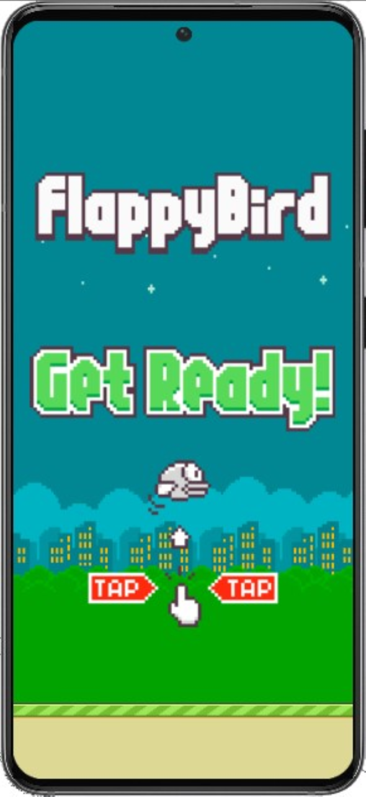
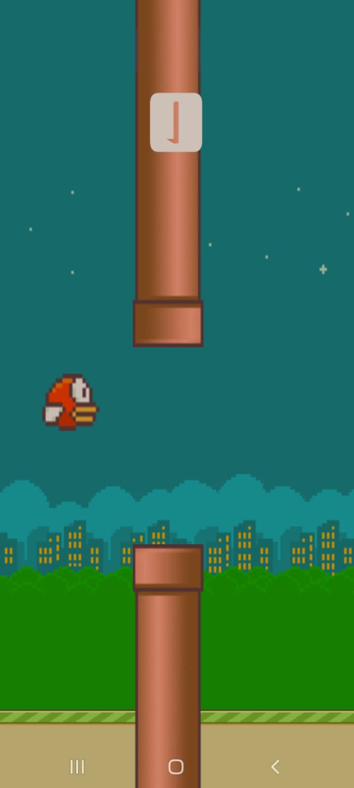

# flappybird_clone
Clone do jogo Flappy Bird desenvolvido com linguagem LUA, utilizando a engine Solar2D. Projeto desenvolvido dentro do curso Desenvolvimento e Programação de Jogos e Sites, do Comitê Para Democratização da Informática de SC - CPDI. 

Flappy Bird game clone, developed using LUA language, at the Solar2D engine. Project developed within the Development and Programming of Games and Websites program, offered by the Committee for the Democratization of Informatics of Santa Catarina - CPDI.

## 🌐 APK

**Google Drive** - ([Download](https://drive.google.com/file/d/1rYwAOzZW3yuexPtnwNKvrfJFRX15HTDk/view?usp=drive_link))

## 🛠️ Construído com

* Lua
* Solar2d

## ✒️ Autor

* **Júlia Conrratt** - [Profile](https://github.com/juliaconrratt)
* **Behance** - [Profile](https://www.behance.net/juliaconrratt)

## 📸 Imagens do projeto

